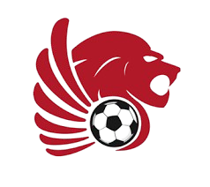

# Kenyan Fantasy League (KFL)

<div align="center">



**The premier fantasy football platform for Kenya's football community**

[](https://opensource.org/licenses/MIT)
[](https://www.python.org/downloads/)
[](https://djangoproject.com/)
[](https://vuejs.org/)
[](https://www.docker.com/)

[Features](#-features) • [Quick Start](#-quick-start) • [Documentation](#-documentation) • [Contributing](#-contributing) • [API](#-api)

</div>

---

## About

**Kenyan Fantasy League (KFL)** is a modern, full-stack fantasy football platform designed specifically for Kenyan Premier League enthusiasts. Create your dream team, compete with friends, and experience the thrill of fantasy football with real KPL data.

### Why KFL?

- **Local Focus**: Built for Kenyan football fans with KPL integration
- **Real-time Data**: Live scores, player stats, and league standings
- **Interactive**: Modern, responsive interface built with Vue.js
- **Secure**: JWT authentication and robust API security
- **Mobile-first**: Optimized for all devices
- **Fast**: Docker-based deployment, Redis caching, async tasks

##  Features

### Core Functionality
- **Fantasy Team Management**: Create and manage your fantasy team with budget constraints
- **Player Transfers**: Smart transfer system with market values and budget tracking
- **Live Scoring**: Real-time points based on KPL player performances
- **League Competition**: Compete against other fantasy managers
- **Formation Tactics**: Multiple formation options (4-3-3, 3-4-3, etc.)

### Technical Features
- **RESTful API**: Complete API access for all functionality
- **Real-time Updates**: Background tasks sync with KPL data sources
- **Responsive Design**: Works seamlessly on desktop, tablet, and mobile
- **Admin Dashboard**: Comprehensive admin interface for data management
- **User Profiles**: Customizable user profiles with stats and achievements

### Upcoming Features
- Live score updates during matches
- Advanced statistics and analytics
- Leagues and mini-competitions
- Social features and community interaction
- Mobile application

## Quick Start

Get KFL running locally in 5 minutes:

### Prerequisites
- [Docker Desktop](https://www.docker.com/products/docker-desktop)
- [Git](https://git-scm.com/downloads)

### 1. Clone & Setup
```bash
git clone https://github.com/your-org/kenyan-fantasy-league.git
cd kenyan-fantasy-league
cp .env.example .env
```

### 2. Configure Environment
Edit `.env` with your settings:
```env
SECRET_KEY=your-very-secure-secret-key-here
DEBUG=1
PG_USER=root
PG_PASSWORD=secure_password_123
POSTGRES_DB=fpl
SIGNING_KEY=your-jwt-signing-key
```

### 3. Launch Application
```bash
# Build and start all services
docker compose up --build -d

# Setup database
make migrate
make superuser

# You're ready!
```

### 4. Access the Platform
- **Frontend**: [http://localhost:3000](http://localhost:3000)
- **API**: [http://localhost:8080/api/v1/](http://localhost:8080/api/v1/)
- **Admin**: [http://localhost:8080/guardian/](http://localhost:8080/guardian/)
- **Monitoring**: [http://localhost:5557](http://localhost:5557) (Flower)

##  Architecture

KFL is built with a modern, scalable architecture:

```
┌─────────────────┐    ┌─────────────────┐    ┌─────────────────┐
│   Vue.js 3      │    │   Django REST   │    │  PostgreSQL     │
│   Frontend      │◄──►│   API Backend   │◄──►│   Database      │
│   (TypeScript)  │    │   (Python)      │    │                 │
└─────────────────┘    └─────────────────┘    └─────────────────┘
         │                        │                        
         │              ┌─────────────────┐              
         │              │     Redis       │               
         └──────────────►│  Cache/Queue    │               
                        └─────────────────┘               
                                 │                        
                        ┌─────────────────┐              
                        │  Celery Workers │               
                        │  (Background)   │               
                        └─────────────────┘               
```

### Tech Stack
- **Frontend**: Vue.js 3, TypeScript, Tailwind CSS, Pinia
- **Backend**: Django 4.2, Django REST Framework, Celery
- **Database**: PostgreSQL 12+
- **Cache**: Redis
- **Infrastructure**: Docker, Nginx
- **Testing**: Pytest, Vue Test Utils
- **Documentation**: Sphinx with MyST

## Documentation

Comprehensive documentation is available:

| Guide | Description |
|-------|-------------|
| [ Full Documentation](docs/) | Complete project documentation |
| [ Installation Guide](docs/source/installation.md) | Detailed setup instructions |
| [ Configuration](docs/source/configuration.md) | Environment and settings |
| [ Architecture](docs/source/architecture.md) | System design and patterns |
| [ API Reference](docs/source/api.md) | Complete API documentation |
| [ Contributing](docs/source/contributing.md) | Development guidelines |

### Build Documentation Locally
```bash
cd docs
make html
# Open docs/build/html/index.html
```

## API

KFL provides a comprehensive REST API:

```bash
# Authentication
POST /api/v1/auth/jwt/create/        # Login
POST /api/v1/auth/users/             # Register

# KPL Data
GET  /api/v1/kpl/teams/              # KPL teams
GET  /api/v1/kpl/players/            # KPL players
GET  /api/v1/kpl/fixtures/           # Match fixtures
GET  /api/v1/kpl/standings/          # League table

# Fantasy Management
GET  /api/v1/fantasy/teams/          # User's fantasy teams
POST /api/v1/fantasy/teams/          # Create fantasy team
POST /api/v1/fantasy/players/        # Add player to team

# User Profiles
GET  /api/v1/profile/                # User profile
PUT  /api/v1/profile/update/{id}/    # Update profile
```

**Example API Usage:**
```javascript
// Get all KPL teams
const response = await fetch('/api/v1/kpl/teams/', {
  headers: {
    'Authorization': `Bearer ${accessToken}`,
    'Content-Type': 'application/json'
  }
});
const teams = await response.json();
```

##  Development

### Quick Development Setup
```bash
# Start development environment
docker compose up -d

# Backend development
make shell                    # Django shell
make test                     # Run tests
make migrate                  # Database migrations

# Frontend development  
cd client
npm run dev                   # Start dev server
npm run test                  # Run tests
npm run build                 # Build for production

# Code quality
make black flake8 isort       # Python formatting & linting
cd client && npm run lint     # Frontend linting
```

### Project Structure
```
kenyan-fantasy-league/
├── apps/                     # Django applications
│   ├── accounts/            # User authentication
│   ├── profiles/            # User profiles
│   ├── kpl/                # KPL data integration
│   └── fantasy/            # Fantasy game logic
├── client/                  # Vue.js frontend
│   ├── src/components/     # Reusable components
│   ├── src/views/         # Page components
│   └── src/stores/        # State management
├── config/                 # Django configuration
├── docs/                   # Sphinx documentation
└── docker/                # Docker configurations
```

## Contributing

We welcome contributions from the community! Here's how to get started:

### Quick Contribution Guide
1. **Fork** the repository
2. **Clone** your fork: `git clone https://github.com/yourusername/kenyan-fantasy-league.git`
3. **Create** a branch: `git checkout -b feature/amazing-feature`
4. **Make** your changes following our [coding standards](docs/source/contributing.md)
5. **Test** your changes: `make test && cd client && npm test`
6. **Commit** with [conventional commits](https://www.conventionalcommits.org/): `git commit -m "feat: add amazing feature"`
7. **Push** to your fork: `git push origin feature/amazing-feature`
8. **Open** a Pull Request

### Areas for Contribution
-  **Bug fixes** - Help improve stability
-  **New features** - Enhance functionality
-  **Documentation** - Improve guides and API docs
-  **UI/UX** - Better user experience
-  **Testing** - Increase test coverage
-  **DevOps** - CI/CD and deployment improvements

### Development Guidelines
- Follow [PEP 8](https://pep8.org/) for Python code
- Use [Conventional Commits](https://www.conventionalcommits.org/) for commit messages
- Write tests for new features
- Update documentation for API changes
- Ensure all tests pass before submitting PRs

Read our full [Contributing Guide](docs/source/contributing.md) for detailed information.


##  Common Commands

```bash
# Essential commands (with Makefile)
make up              # Start all services
make down            # Stop all services  
make migrate         # Run database migrations
make test            # Run all tests
make superuser       # Create admin user
make logs            # View application logs

# Database operations
make dbshell         # Access database shell
make makemigrations  # Create new migrations

# Code quality
make black           # Format Python code
make flake8          # Lint Python code
make isort           # Sort Python imports

# Frontend operations
cd client
npm run dev          # Start development server
npm run build        # Build for production
npm run test         # Run frontend tests
npm run lint         # Lint frontend code
```

## Troubleshooting

### Common Issues

**Port conflicts:**
```bash
# Check port usage
netstat -ano | findstr :3000    # Windows
lsof -i :3000                   # macOS/Linux

# Change ports in docker-compose.yml if needed
```

**Database connection issues:**
```bash
# Check database logs
docker compose logs postgres-db

# Reset database (development only)
docker compose down -v
docker compose up -d
make migrate
```

**Container build failures:**
```bash
# Clean rebuild
docker compose down -v
docker system prune -f
docker compose build --no-cache
docker compose up -d
```

Need more help? Check our [Installation Guide](docs/source/installation.md) or [Troubleshooting Documentation](docs/source/troubleshooting.md).

## License

This project is licensed under the MIT License - see the [LICENSE](LICENSE) file for details.

## Acknowledgments

- **Kenyan Premier League** for inspiring this project
- **Django** and **Vue.js** communities for excellent frameworks
- **Contributors** who help make this project better
- **Kenyan football fans** for their passion and support

## Support & Contact

- ** Bug Reports**: [Open an issue](https://github.com/your-org/kenyan-fantasy-league/issues)
- ** Feature Requests**: [Start a discussion](https://github.com/your-org/kenyan-fantasy-league/discussions)
- ** Questions**: Check our [documentation](docs/) or [discussions](https://github.com/your-org/kenyan-fantasy-league/discussions)

---

<div align="center">

**Built with for the Kenyan football community**

[Star this project](https://github.com/your-org/kenyan-fantasy-league) • [🍴 Fork it](https://github.com/your-org/kenyan-fantasy-league/fork) • [Share it](https://twitter.com/intent/tweet?text=Check%20out%20Kenyan%20Fantasy%20League%21&url=https%3A//github.com/your-org/kenyan-fantasy-league)

</div>
